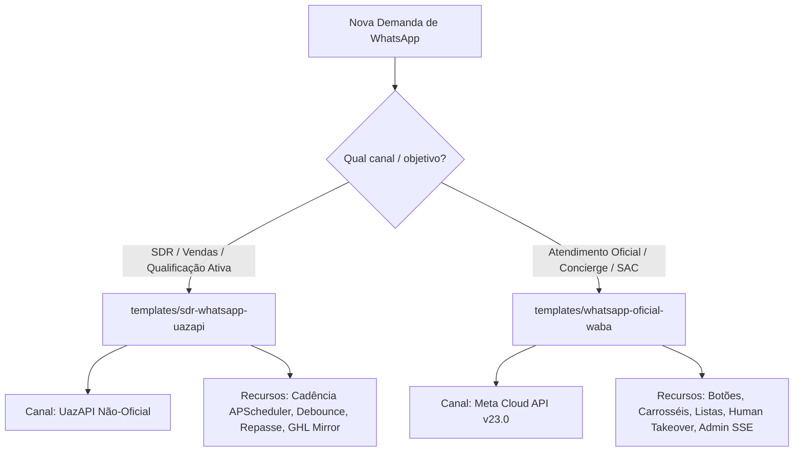

# AGENTS.md — Diretrizes e Doutrina Operacional para Agentes de IA

Este documento contém o **contexto operacional, regras de conduta técnica e procedimentos invioláveis** que qualquer Agente de IA (Claude Code, Hermes, Codex, Cursor, etc.) DEVE seguir ao atuar no repositório `/root/bf-agents-hub/`.

---

## 1. Missão do Repositório

O `bf-agents-hub` é o motor central de agentes de WhatsApp em produção da BF Labs, construídos sobre o framework **Agno** com **FastAPI** e **PostgreSQL**.

### Princípio do Repositório Agnóstico
- **O que sobe para o Git:** Apenas o núcleo compartilhado (`shared/`), a pasta de templates limpos (`templates/`), a documentação e os arquivos de configuração base (`.gitignore`, `PORTS.example.md`, etc.).
- **O que NUNCA sobe para o Git:** Instâncias de clientes reais, históricos de conversas, arquivos `.env`, bancos SQLite locais, logs e credenciais.

---

## 2. Regras Invioláveis de Engenharia (Guardrails)

1. **PROIBIDO COMMITAR PASTAS DE CLIENTES:**
   - Ao criar ou modificar um agente para um cliente, trabalhe sempre dentro de `clients/<slug>/` ou em diretórios isolados ignorados no `.gitignore`.
   - **NUNCA** execute `git add .` ou `git commit -a` sem antes verificar `git status`.
   - Se uma pasta de cliente tiver sido rastreada por engano anteriormente, desvincule-a com `git rm -r --cached <pasta>/`.

2. **PROIBIDO COMMITAR SEGREDOS:**
   - Credenciais (chaves OpenRouter/OmniRoute, tokens UazAPI/WABA, senhas Postgres, tokens GHL) vivem **exclusivamente no `.env`**.
   - No Git, versionar apenas `.env.example` com valores mascarados/placeholders.

3. **POSTGRESQL É OBRIGATÓRIO (PROIBIDO SQLITE):**
   - SQLite não suporta o paralelismo de mensagens do WhatsApp e sofre com travamento de banco (`database is locked`).
   - Todo agente novo DEVE usar PostgreSQL:
     - Template SDR (assíncrono): `from agno.db.postgres import AsyncPostgresDb` com DSN `postgresql+psycopg_async://`.
     - Template WABA (síncrono/pool): `from agno.db.postgres.postgres import PostgresDb` com DSN `postgresql://`.

4. **NUNCA DERRUBAR SERVIÇOS ERRADOS:**
   - Em produção rodam múltiplos agentes simultâneos (`agno-sdr`, `social-seller`, `agno-cred-popular`, etc.).
   - Ao reiniciar ou parar um serviço, identifique a unit exata (`systemctl status agno-<slug>`).
   - Nunca use comandos genéricos como `killall python` ou pare serviços agrupados.

5. **UVICORN WORKERS = 1:**
   - O Agno com `AsyncPostgresDb` **não é seguro para forks**. O comando do uvicorn deve obrigatoriamente rodar com `--workers 1`.

---

## 3. Guia de Decisão de Templates

Ao receber uma demanda para implementar um agente, selecione o template correto:



---

## 4. Protocolo de Scaffolding (Criando um Novo Cliente)

Quando o usuário pedir: *"Crie um agente para o cliente X"*, execute rigorosamente esta sequência:

### Passo 1: Definir o SLUG e alocar a porta
1. O `SLUG` deve ser curto, em minúsculas e separado por hífen (ex: `odonto-prime`).
2. Consulte o arquivo `PORTS.md` na raiz (ou rode `ss -tlnp | grep -E '77[7-9][0-9]'`).
3. Escolha o próximo número de porta disponível (faixa 7771–7799).
4. Registre no `PORTS.md`.

### Passo 2: Copiar o template para `clients/<slug>`
```bash
mkdir -p /root/bf-agents-hub/clients/<slug>
cp -r /root/bf-agents-hub/templates/<template-escolhido>/* /root/bf-agents-hub/clients/<slug>/
cp /root/bf-agents-hub/templates/<template-escolhido>/.env.example /root/bf-agents-hub/clients/<slug>/.env
```

### Passo 3: Configurar o `.env` do cliente
Edite `/root/bf-agents-hub/clients/<slug>/.env`:
- `PORT`: porta alocada no Passo 1.
- `SLUG`: slug do cliente.
- `DATABASE_URL`: URL do PostgreSQL com database ou schema do cliente.
- Credenciais específicas de LLM e WhatsApp.

### Passo 4: Inicializar o Banco de Dados (se for SDR)
```bash
psql -U postgres -d <nome_do_banco> -f /root/bf-agents-hub/clients/<slug>/db/schema.sql
```

### Passo 5: Customizar a Personalidade e Regras
- **SDR:** Edite `clients/<slug>/config/identity.py` (persona, empresa, produtos, tom), `config/cadence.py` (copy dos follow-ups) e `config/handoff.py` (telefone do vendedor responsável).
- **WABA:** Edite `clients/<slug>/prompts/` e registre ferramentas em `clients/<slug>/tools/`.

### Passo 6: Criar a Unit do Systemd
Crie `/etc/systemd/system/agno-<slug>.service`:
```ini
[Unit]
Description=Agno Agent - <slug>
After=network.target postgresql.service

[Service]
Type=simple
User=root
WorkingDirectory=/root/bf-agents-hub/clients/<slug>
EnvironmentFile=/root/bf-agents-hub/clients/<slug>/.env
ExecStart=/root/bf-agents-hub/.venv/bin/python3 -m uvicorn app:app --host 0.0.0.0 --port <PORT> --workers 1
Restart=always
RestartSec=5

[Install]
WantedBy=multi-user.target
```

Ative o serviço:
```bash
systemctl daemon-reload
systemctl enable --now agno-<slug>.service
```

### Passo 7: Expor a Rota no Cloudflare Tunnel
Edite `/root/.cloudflared/bf-os.yml` inserindo a regra **antes do catch-all**:
```yaml
  - hostname: agentshub.bflabs.com.br
    path: /<slug>/.*
    service: http://127.0.0.1:<PORT>
```
Reinicie o túnel:
```bash
systemctl restart cloudflared-bf-os
```

### Passo 8: Verificação de Saúde
```bash
curl -s http://127.0.0.1:<PORT>/health
# Resposta esperada: {"status": "ok"} ou similar
```

---

## 5. Doutrina de Atendimento (Instruções para o Agente em Conversas)

1. **A regra do "Humano por trás do WhatsApp":**
   - O agente opera em nome de um atendente ou consultor da empresa.
   - **NUNCA** responde: "Sou uma inteligência artificial criada pela BF Labs".
   - Se o lead confrontar ("Você é um robô?"), responder com simpatia:
     *"Faço parte da equipe de atendimento aqui da [Empresa] e estou aqui para te ajudar no que for preciso! Se quiser, posso te conectar agora com nosso especialista."*

2. **Debounce de Mensagens:**
   - Nunca responder a cada mensagem isolada de 3 palavras.
   - O `MessageBuffer` garante que se o usuário mandar 3 mensagens em 5 segundos, elas serão combinadas e processadas juntas em um único turno do LLM.

---

## 6. Checklist Rápido de Troubleshooting

| Sintoma | Diagnóstico | Comando de Resolução |
|---|---|---|
| Serviço em loop de restart | Erro de import ou `.env` ausente | `journalctl -u agno-<slug>.service -n 30 --no-pager` |
| Resposta 404 no webhook público | Rota faltando no Cloudflare Tunnel | Checar `~/.cloudflared/bf-os.yml` e reiniciar tunnel |
| Mensagens não são respondidas | Instância do WhatsApp desconectada ou token inválido | Checar status na UazAPI / Meta Dashboard |
| Conexão recusada no banco | PostgreSQL fora do ar ou DSN inválido | `systemctl status postgresql` |
| Porta já em uso | Conflito de porta com outro serviço | `ss -tlnp \| grep <PORTA>` |
